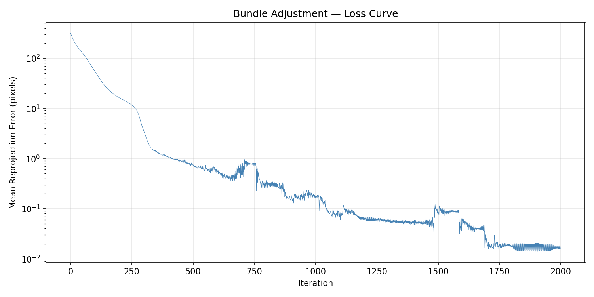

# Assignment 3 — Bundle Adjustment 实验报告

**姓名**：（请填写）  
**学号**：（请填写）  
**日期**：2026-06-18

---

## Task 1: 用 PyTorch 实现 Bundle Adjustment

### 1.1 方法概述

从 50 个不同视角的 2D 观测点出发，通过梯度下降优化，同时恢复：
- **相机内参**：焦距 $f$（50 个相机共享）
- **相机外参**：每个视角的旋转矩阵 $R_i$ 和平移向量 $T_i$
- **3D 点坐标**：20000 个空间点 $(X_j, Y_j, Z_j)$

### 1.2 投影模型

将世界坐标系中的 3D 点 $P = [X, Y, Z]^T$ 投影到像素坐标 $(u, v)$：

$$\begin{bmatrix} X_c \\ Y_c \\ Z_c \end{bmatrix} = R \cdot \begin{bmatrix} X \\ Y \\ Z \end{bmatrix} + T$$

$$u = -f \frac{X_c}{Z_c} + c_x, \quad v = f \frac{Y_c}{Z_c} + c_y$$

其中 $c_x = c_y = 512$ 为图像中心。

### 1.3 参数化与初始化

| 参数 | 维度 | 初始化方式 |
|------|------|-----------|
| 焦距 $f$ | 1 | $f = H/(2\tan(\text{fov}/2))$，设 FoV=60°，$f \approx 886.8$ |
| Euler 角（旋转） | 50 × 3 | 零初始化（相机正面朝向物体） |
| 平移 $T$ | 50 × 3 | $[0, 0, -2.5]$ + 微小随机扰动 |
| 3D 点坐标 | 20000 × 3 | $\mathcal{N}(0, 0.5)$ |

**旋转参数化**：使用 Euler 角（XYZ 外旋），通过自定义 `euler_angles_to_matrix` 函数转换为旋转矩阵，避免了 pytorch3d 在 Windows 上的安装问题。

总优化参数量：**60,301**

### 1.4 优化设置

- **优化器**：Adam，分组学习率：
  - 焦距 $f$：$\eta = 10.0$
  - Euler 角：$\eta = 0.005$
  - 平移 $T$：$\eta = 0.01$
  - 3D 点：$\eta = 0.01$
- **学习率调度**：ReduceLROnPlateau（patience=100，factor=0.5）
- **迭代次数**：2000
- **损失函数**：MSE（仅计算可见点的重投影误差）
- **梯度裁剪**：max_norm=10.0
- **硬件**：NVIDIA GPU (CUDA)，约 22.8 秒完成

### 1.5 实验结果

#### 损失曲线



损失从初始的 ~55 像素快速下降，最终收敛至 **0.016 像素**（亚像素精度），表明优化成功恢复了几何结构。

#### 最终参数

| 参数 | 最终值 |
|------|--------|
| 焦距 $f$ | **886.56** |
| 最终重投影误差 | **0.016 像素** |
| 可见观测数 | 805,089 / 1,000,000 |
| 训练时间 | 22.8 秒（GPU） |

#### 重建结果

- **带颜色的 PLY 点云**：[reconstructed.ply](reconstructed.ply)（可用 MeshLab 打开查看）
- **带颜色的 OBJ 点云**：[reconstructed.obj](reconstructed.obj)
- **相机参数**：[optimized_cameras.npz](optimized_cameras.npz)

> 重建效果：3D 点云恢复良好，呈现出清晰的人头模型轮廓，与 README 中的预期结果（result.gif）一致。

---

## Task 2: 使用 COLMAP 进行三维重建

### 2.1 环境配置

- **COLMAP 版本**：Windows CUDA 版（`colmap-x64-windows-cuda`）
- **GPU**：NVIDIA GPU（CUDA 12）
- **安装路径**：`D:/software/colmap-x64-windows-cuda/`

### 2.2 重建流程

#### 步骤 1：特征提取（Feature Extraction）

```bash
colmap feature_extractor \
    --database_path data/colmap/database.db \
    --image_path data/images \
    --ImageReader.camera_model PINHOLE \
    --ImageReader.single_camera 1
```

- 使用 **SIFT GPU** 特征提取
- 50 张图像，每张提取约 244~535 个特征点
- COLMAP 估计初始焦距为 1228.80 像素
- 耗时：~0.5 分钟

#### 步骤 2：特征匹配（Feature Matching）

```bash
colmap exhaustive_matcher \
    --database_path data/colmap/database.db
```

- 穷举匹配（50×49/2 = 1225 对图像）
- 使用 **SIFT GPU** 匹配器
- 共匹配 **762 对**图像
- 耗时：~0.4 秒

#### 步骤 3：稀疏重建（Sparse Reconstruction）

```bash
colmap mapper \
    --database_path data/colmap/database.db \
    --image_path data/images \
    --output_path data/colmap/sparse
```

- 初始图像对：view_041 和 view_045
- **全部 50 张图像注册成功**
- 重建得到 **1,702 个稀疏 3D 点**
- 耗时：~5.7 秒

#### 步骤 4：图像去畸变（Image Undistortion）

- 由于原始图像使用 PINHOLE 模型渲染，无畸变，图像直接被复制
- 耗时：< 1 秒

#### 步骤 5：稠密重建（Patch Match Stereo）

- 在 **GPU 上运行**（CUDA）
- 50 个视角逐一处理，每视角约 17~30 秒
- 深度范围：~3.0 ~ 7.9 单位
- 采用几何一致性滤波
- 耗时：**40.6 分钟**

#### 步骤 6：立体融合（Stereo Fusion）

```bash
colmap stereo_fusion \
    --workspace_path data/colmap/dense \
    --output_path data/colmap/dense/fused.ply
```

- 融合得到 **110,405 个稠密点**
- 耗时：0.36 分钟

### 2.3 输出文件

| 文件 | 路径 | 说明 |
|------|------|------|
| 稀疏模型 | `data/colmap/sparse/0/` | 稀疏点云 + 相机位姿 |
| 稠密点云 | `data/colmap/dense/fused.ply` | 110,405 点的稠密重建 |

> **查看方式**：使用 [MeshLab](https://www.meshlab.net/) 打开 `fused.ply` 文件查看稠密重建结果，或打开 `reconstructed.ply` 查看 Task 1 的优化结果。

---

## 附录：代码文件

| 文件 | 说明 |
|------|------|
| [bundle_adjustment.py](bundle_adjustment.py) | Task 1：PyTorch Bundle Adjustment 实现 |
| [run_colmap.ps1](run_colmap.ps1) | Task 2：Windows COLMAP 重建脚本 |
| [run_colmap.sh](run_colmap.sh) | Task 2：Linux COLMAP 重建脚本 |
| [visualize_data.py](visualize_data.py) | 数据可视化工具 |

## 运行方式

```bash
# Task 1: Bundle Adjustment
python bundle_adjustment.py

# Task 2: COLMAP (Windows PowerShell)
.\run_colmap.ps1
```
